Over my twenty years of development experience and fourteen years managing source code on teams, I've had the opportunity to work with companies in various stages launch products and refine development practices. One development practice that always comes up is their Version Control System (VCS). When done right, the VCS helps contribute to and enforce the software life cycle that the product owners want to use. The opposite is also true: the VCS can also introduce headaches for developers, product owners, or both.

I can always tell right away that something is off through several ways, to name a few:

*   When product owners complain that they can't get just the changes they want, or can't reproduce a specific build the way they need.
*   When developers complain about too many conflicts, or that producing the final source code of the build is cumbersome.
*   When delays are introduced to a release schedule because a non-essential feature for the release is in the release candidate and not quite done.

This post contains the process that was developed eight years ago over the course of several weeks with much debate with a group of my co-workers while referencing other established models. At the time, due to constraints from the product owners, we had what we thought was a unique situation: a three-month lead time between development starting and releasing to the public, while having releases every 6 weeks. The first month was development, the second month was internal QA (while developers started working on the next release), and the third was external QA and regression testing. We later realized that, although three-months was irregular, planning out the current release and the next release is just common business practice. Since then, I've made minor tweaks to the process, including handling multiple release lines (for a versioned SAS API) and finding where processes could be automated. (Unfortunately, those scripts were proprietary so I can't share them at this time.)

What business needs does this model cover?
==========================================

In addition to standard Git features like working collaboratively, this branching model supports:

*   Gated releases with QA/management final approval.
*   Planning for future releases.
*   Supporting multiple past releases.
*   Tracking features in a release.
*   Dropping features from a release.
*   Framework/infrastructure branches that do not correspond to a single feature.
*   Tagged releases for auditing.

Some of these might not be necessary for your use-case, but in every company I've worked for, even though some weren't needed initially, almost all ended up being used eventually.

_Supporting multiple past releases is not always needed for websites, but is necessary for versioned APIs, and we used it once to roll-back a Christmas promotion while most developers were on vacation._

Main Principles
===============

The following principles were discovered while working on the model that I've used to guide me in difficult situations; these principles helped form the idea of the secondary types of branches.

**Isolation Until Finalized**
-----------------------------

Work product is relatively isolated from other changes that are irrelevant until one of two conditions: the other changes are finalized and approved, or the other changes are recognized as prerequisites. Testing and conflicts are managed through special branches that can be included or excluded as needed, keeping the original work pristine.

_Why?_ Keeping things separated is critical if your company wants to have control over the direction of the product. While no one wants to see their work wasted, the last thing that you want is a cost on reversing a bad business decision because of a source code reason for your next release. Also, you really don't want to be the one saying the deadline can't be met because a broken feature can't be pulled.

**Multiple Bases**
------------------

Because changes are isolated, we keep a concept of multiple bases on any kind of integration branch. The bases are referred to as "upstream", with the reverse of "downstream" also applying.

_Why?_ Once a project grows beyond a small prototyping team, rarely are features considered in completely linear thought processes. A cohesive product needs to be interlinked in many different ways; as a result, unless you wait until a feature is fully released before developing an enhancement, so will your dependency chains.

**Immediate Downstream Propagation**
------------------------------------

As soon as changes are made, they get propagated downstream to anything based on it. This keeps the changes from being isolated, and keeps branches fresh despite the longer lifetimes. Immediate propagation also reveals conflicts early, which helps them be resolved easier as the intent of the code is still fresh in developers' minds.

_Why?_ In lieu of doing continuous integration the old-fashioned way, forcing all downstream branches to be updated keeps developers aware of how the system is shaping up as a whole. When a developer is focused on their branch, they see only the changes in their prerequisites and, provided no conflicts are arising, receive them automatically. Otherwise, they get alerted to how their code collides with others as soon as it happens, too, via PRs against their branch or from their branch, and because it happens immediately, it also ensures the code is fresh in developers' minds if there are merge conflicts. Even more, it can raise the attention of overlapping features that might not have otherwise been called out despite product planning and gives opportunities for developers to reach out to each other and to product owners.

Secondary Principles
--------------------

These principles are derived from the main ones, so do not really stand on their own. However, they are helpful to keep in mind.

**No upstream propagation.** Merging code upstream violates isolation rules, especially when immediate downstream propagation is applied.

**No branch is sacred.** No permanent branches exist in this strategy; every branch type has a clear way to start it and end it. Fortunately, this makes it easy to adopt more advanced versions of the strategy when you need the functionality, or drop bits that are cumbersome.

**Move infrastructure out.** Because everything stays isolated until a release, if developers aren't careful, infrastructure changes don't make it to other developers, or even other features by the same developer. As a result, I've recommended recognizing these infrastructure changes and moving them into their own branch, so much so that it's become its own branch type.

Types of Branches
=================

The primary types of branches are as follows:

*   **Feature**. These represent the basic unit of business work that can be included or excluded from a release. In your ticketing system, they may correspond to epics, stories, bugs, or any other number of nomenclatures. They last until they are released, as bug fixes are applied directly to the features that the bug resulted from.

Features are indicated as blue lines with small commit dots, with special commits being large dots.

*   **Release Candidate**. These progress from being release candidates to released versions. No work should be done directly on a release candidate.

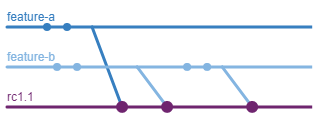

Release candidates are purple, and have their release version prefixed with \`rc\`.

*   **Service Line**. These represent released versions of the product where patch releases and hotfixes are supported. When a product only needs one of these, it is often referred to as "master". No work should be done directly on a service line.

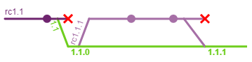

Service lines are green and usually only have fast-forwards to them, so we don't put commit dots. These are also commits that are tagged with the release number. Red X's are used to indicate when a branch is deleted.

Flowing between these three is each one way: Service Line → Feature Branch → Release Candidate → Service Line. This one-way flow both prevents conflicts and the pollution of unwanted dependencies.

Secondary Branch Types
----------------------

*   **Hot Fix**. These are patches to an existing service line that can get tested individually. They act as a feature and release candidate as one, and are intended for quick individual fixes.

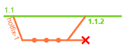

Hotfixes are orange and labelled as such.

*   **Infrastructure**. These are for development not tied to a specific feature, but can assist multiple features. These branches are be tied to a specific need of the development team, such as a database change, a framework update, etc. that has cross-cutting concerns, but may not have any business value and may not be tracked directly by management for QA. As a result, infrastructure does not release without a host feature and often releases in association with multiple features. (Some teams prefer to have other names, such as "framework" or "architecture" for these types of branches, especially given various business methodologies.)

Infrastructure branches are blue in these examples, just like features

*   **Integration**. These are for multiple features that have overlapping functionality, especially in the cases of merge conflicts, but also when there are special cases, such as bugs, that only occur when two or more specific branches (feature, infrastructure, or another integration branch) are merged together. Only these special cases should be worked on an integration branch.

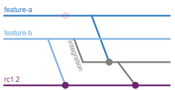

Integration branches are grey, and the red circles show the branch that was attempted to be merged that had conflicts. The conflicting merge is cancelled, and a new integration branch is made immediately.

The Main Flow
=============

This is a basic summary of the whole flow, with more detailed information in the relevant sections.

1.  The developer creates a feature branch from a service branch, infrastructure branch, prerequisite feature branch, or integration branch if multiple branches are required. (See [_Selecting a Starting Branch_](#bdc9).)
2.  The developer makes all changes necessary for their feature in the feature branch. QA may happen on the feature branch directly to test the feature in isolation.
3.  The developer merges the feature branch into the release candidate branch targeted for the feature if there are no conflicts. If there are conflicts, the developer needs to make an integration branch and merge that into the release candidate. (See [_Updating a Release Candidate_](#2691)_._)
4.  If further changes need to be made on the feature, such as bug fixes unrelated to another feature, the changes should be done on the original branch and merged again into the release candidate. (See [_Updating a Release Candidate_](#2691)  and [_Creating a Release Candidate_](#abb1)_.)_
5.  When the release candidate is approved (See [_Approving a Release Candidate_](#cb2b)) and is merged into a service line (note that if things are done right, this should be a fast-forward merge), the feature branch (and any infrastructure or integration branches that were in the service line) should be deleted from the remote. Other outstanding release candidate branches should be populated immediately with the service line updates if they were based on the release candidate.

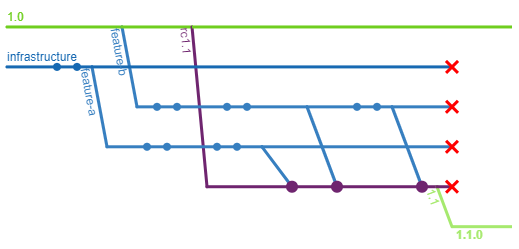

Selecting a Starting Branch
===========================

This is likely the most difficult part of this branching strategy for most developers: they must be aware of what prerequisites they have when they start. This means being aware of other features being worked when creating the starting branch. (For developers that prefer to remain blissfully ignorant of the larger complex project, this puts heavier burdens on leadership. For the company, it forces conversations about what and when a feature needs to be developed.)

1.  Determine all prerequisite features and infrastructure. The product owner should be involved with identifying prerequisite features, or it might already be explicitly stated in the ticketing system to prioritize work. For example, an enhancement to an admin page would have the admin page itself as a prerequisite if it wasn't in a previous release.
2.  If more than one prerequisite branch is needed, find or create an integration branch with all the prerequisites, selecting from other integration branches if possible and switching to them if they arise. Doing so will prevent conflicts from future updates being hidden in your feature branch, allowing other developers or release candidates to use them. This integration branch should be kept up-to-date with the upstream branches.
3.  If no integration branch exists or only one feature is needed, branch from the feature branch. The new branch should be kept up-to-date with the upstream branch.
4.  If no features are required, branch from an infrastructure branch if one is needed. The new branch should be kept branch up-to-date with the upstream branch.
5.  If no infrastructure or other feature is required, branch from a service line. The service line should either be the latest (for new work) or the service line that the feature will go into (for enhancing previous work or lower versions,) but there are other service line strategies. The new branch should be kept up-to-date with the upstream branch.

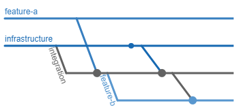

Integrating multiple branches before branching from them keeps feature-b isolated from conflicts between feature-a and the infrastructure.

Do not rebase; [it prevents others from following this process](https://medium.com/@matt.dekrey/git-how-i-use-it-and-why-i-dont-use-gitflow-8688f255fef2). Rebase treats branches as having only one base, whereas this model requires that each branch has more than one.

Creating a Release Candidate
============================

Creating a release candidate is fortunately fairly straightforward.

1.  Branch from either a service line or a preceding release candidate if one is still in progress when you need to begin preparing for the next release. (When getting started with this flow, a release candidate may be created from any feature, too.)
2.  Merge any and all other branches that are being considered for the release, preferring integration branches. (Infrastructure branches should not be directly merged for release candidates, as they are not related to business needs; instead, merge the features that include them.) If any conflicts occur, an integration branch must be made first.

You can prepare for multiple upcoming releases at the same time, splitting features between release candidates. (Features omitted for brevity.)

Updating a Release Candidate
============================

Anytime a release candidate is updated with fresh feature code, follow this process.

1.  Downstream release candidates should be immediately merged into with the new changes. (Note: conflicts may arise here; if they do, create integration branches again with the conflicting features. See [_Rebuilding a Release Candidate_](#2bae).)

Release candidates should have no other types of downstream branches.

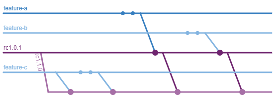

Keep propagating downstream.

To remove code from a release candidate, see [_Rebuilding a Release Candidate_](#2bae).

Approving a Release Candidate
=============================

After any business practices required to approve a release candidate, such as QA, UAT, automated testing, etc., follow the following process.

1.  A tag should be marked on the specific version that was approved.
2.  The code tagged gets merged into the corresponding service line. (Note that if things are done correctly, this will be a fast-forward merge.)
3.  Delete any branches that were in the release candidate. Also delete the release candidate itself.
4.  Treat anything that was based on the release candidate as now being based upon the new service line.
5.  Follow the instructions in [_Updating a Service Line_](#af57). Don't forget anything that was previously based on the old release candidate, such as other release candidates.

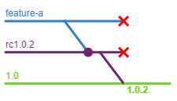

Here, the tag is shown on the service line instead of the commit, but it's also a fast-forward; all tags end up on a service line eventually, so it's just easier to visualize them there.

Updating a Service Line
=======================

Because there's lots of code based off of a service line, the process of updating a service line is a bit more lengthy.

1.  The direct downstream service lines should be immediately merged into with the new changes.(Note: Conflicts may arise here, and should be reviewed by developers that made the change to determine how to solve it in the later service line.)
2.  If there are integration branches that have had all but one of their features included in the service branch update (for example, integration of features A and B when the service line update includes A, or integration of features A, B, and C when the service line update includes A and B), the integration branch should be merged into the remaining feature and then deleted. (This allows us to resolve the conflicts the same way as we did before without having to do them again. You may still get other conflicts from the next step, but not the same ones as were in a known integration branch.)
3.  Any downstream integration or feature branches should be immediately merged into with the new changes. (Note: conflicts may arise here. Those should be left to the developers of the integration/feature branches.)
4.  Any downstream release candidates from an updated service line should be immediately merged with the new changes. (Note: conflicts may arise here. If supporting being able to drop features from a release candidate, see [_Rebuilding a Release Candidate_](#2bae).)

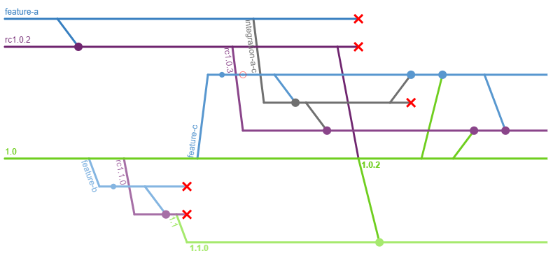

Step 1 is displayed from 1.0 to 1.1. Step 2 is represented with integration-a-c into feature-c. Step 3 is shown for 1.0 to feature-c. Step 4 is indicated by 1.0 to rc1.0.3.

Hotfixes
========

When working a hotfix:

1.  The developer creates a hotfix branch from the earliest service line branch to which the hotfix applies.
2.  The developer makes all changes necessary for the hotfix. QA may happen on the hotfix branch, assuming only one hotfix is being made for the release. Otherwise, a new release candidate branch should be made and the hotfix branches get treated like feature branches. (See [_The Main Flow_](#49e4) instead.)
3.  When the hotfix is approved, it works as a release candidate: it is merged into the service line (again, note that if things are done correctly, this should be a fast-forward merge) and removed. (See [_Updating a Service Line_](#af57).)

Rebuilding a Release Candidate
==============================

Rebuilding a release candidate is costly without automation, but is the surest way to eliminate an unwanted feature from a release candidate. It can also be useful to eliminate merge conflicts and other issues arising indirectly from developers' work.

1.  Delete the old release candidate.
2.  Recreate the release candidate from the same parent branch.
3.  Merge all the desired features and integration branches in. These should not conflict if developers have been making the appropriate integration branches along the way. If there are conflicts, exclude the branch and require an integration branch, as in [_The Main Flow_](#49e4).
4.  Rebuild all downstream release candidates, if any. Consider adding the excluded features in one of the downstream release candidates.

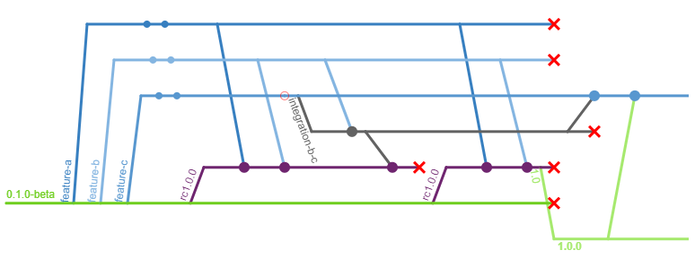

Eliminating feature-c from release version 1.0.0 allowed us to get the release out to customers according to our marketing release schedule. Afterwards, the beta was no longer needed, so we removed the service line, and kept the merge conflict resolution we already had between feature-b and feature-c without maintaining the extra branch.

Switching Over
==============

Starting out with a branching strategy is easiest, but only happens so often. The reality is that this process is pretty easy to adopt: you can start with a single branch (such as your old `develop` branch) and treat it as infrastructure. From that point on, branch from it as though it were infrastructure, and start building up to release lines. A full example is below.

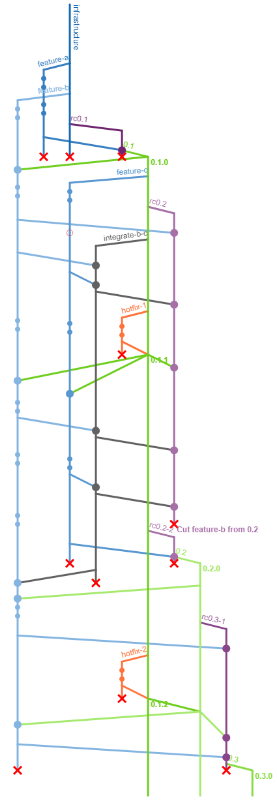

Yep, there's a lot going on here, but it's all covered!

Automation
==========

Several parts of this flow can be automated; I'll go into more details in the future. However, a few details from what I've done in the past.

Immediate forward propagation
-----------------------------

The easiest thing is to be able to support immediate forward propagation: any branch that receives an update gets pushed automatically to any branches that are downstream. A further trick: if conflicts arise, open a PR directly or create an integration branch, as the behavior requires.

Building Release Candidates
---------------------------

Release candidates can be built from a manifest; it makes it significantly simpler to keep them up to date if the forward propagation handled automatically. However, the cleanest release candidates are rebuilt from scratch each time, which helps identify the need for integration branches. Of course, it also helps the case of dropping features, as it becomes completely painless to build a new release candidate.

Thank you!
==========

Thanks for reading. I hope that you learned something that you can take back to your process.

Special thanks must go to my coworkers at the time who contributed to the original design, including Ryan Bovermann, Adam Brill, and Abraham French. Everyone helped proofread this accounting of the system, despite all of us working on different projects.

References
==========

All links valid as of 7/31/2017 if you need to go back using an internet archive tool.

[FrequencyReducesDifficulty by Martin Fowler.](https://martinfowler.com/bliki/FrequencyReducesDifficulty.html)

[A successful branching model. (aka GitFlow)](http://nvie.com/posts/a-successful-git-branching-model/)

[Microsoft's Branching Strategies.](https://www.visualstudio.com/en-us/articles/branching-strategies-with-tfvc)
