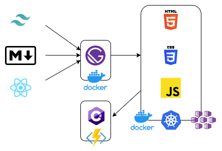

import FigCaption from '../components/FigCaption';
import ogImage from './architecture.png';
export { ogImage };

I don't like maintenance. I prefer to make things that can just continue to run
on their own and don't require constant fixing or upkeep. As a result, almost
always my own website (probably where you're reading this at DeKrey.NET) is
behind the times. Occasionally, I rebuild it. When I do, as I did just recently,
it needs to be simple with no APIs that can break down and leave my site dark
until I take the time to resurrect it again. If you want a fast, low maintenance
website, raw HTML can't be beaten. As a result, it tends to be relatively
boring, linking people off to other sites.

But... raw HTML isn't great for maintenance. Writing a full blog in vanilla HTML
would be an arduous task. Markdown is a great alternative, but I don't really
like it for a complete site. React works well for sites, but makes for a poor
tool for writing a blog. For a long time, I felt stuck.

Then I found [GatsbyJS](https://www.gatsbyjs.org/). A static site renderer?
Sounds relatively boring. But, a static site won't break down. You can tell if
it works before you upload it. There's definitely something valuable here. So, I
decided to try it out. (I've also been working on quite a few front-end things
lately, so I wanted to try [tailwindcss](https://tailwindcss.com/) - which
[Justin Myers](http://justindmyers.com/) has been talking up to me for a while.)
And so, I followed the [GatsbyJS tutorial](https://www.gatsbyjs.org/tutorial/),
tossing in my hosting preference, I designed the following architecture.

<figure>

<FigCaption>Markdown, React, and tailwindcss assembled by GatsbyJS in a Docker containerpublishing static HTML, CSS, and JS in a production Docker container, hosted on Azure Kubernetes Service (AKS) and calling out to an Azure Functions application for the Contact form. </FigCaption>
</figure>

Wow, okay, so, when written out this way, it doesn't look simpler. Then again, I
added a blog (everything before was on Medium), and it's pre-rendered.

Creating a Dockerfile for hosting GatsbyJS was quite straightforward:

```Dockerfile
FROM node:12 AS builder

WORKDIR /src
ADD package*.json ./
RUN npm ci
ADD . ./
RUN npm run build

FROM gatsbyjs/gatsby
COPY --from=builder /src/public /pub
```

The `gatsbyjs/gatsby` image is a specialized nginx image designed to handle some
smart defaults for a GatsbyJS site, such as the location of the 404 page.

All-in-all, I'm happy with my new site.