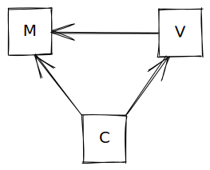
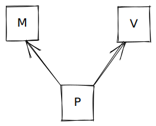
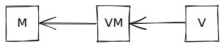

import FigCaption from '../components/FigCaption';

Many developers have heard of MV-* design patterns (most commonly MVC), but most don't know the purpose - or most of the
alternatives - to this very rich family of patterns.

## Why MV-*?

MV-* patterns are a family of patterns for connecting the Model and View contexts of a given application. Part of what
I find fascinating is that both the "view" and the "model" remain vague and undefined: it's still the developer's job to
define both. A view is generally something external to the application (and often human-understandable) but these are
not mandatory requirements for the view. The common part of every MV-* pattern is that the Model remains pure of
View-specific concepts, allowing it to focus on the concepts it is modeling.

## The patterns

There are three primary patterns for MV-*, each reaching back decades, though the names have shifted.

### Model View Controller (MVC)

From what I can tell, the Model View Controller pattern is the oldest MV-* design pattern. The idea is to use a
portion of code known as the Controller to map from the Model to the View. The Controller is frequently permitted to
pass some models directly to the View. As such, the dependency tree for MVC can be constructed as follows:

<figure>

<FigCaption>The View can access Model components, the Controller orchestrates both the View and the Model, and the Model remains pure.</FigCaption>
</figure>

With the View depending directly on the Model, there are some drawbacks: changes to the Model require refactoring of the
View. If the View doesn't have strong-typing or great test coverage, bugs will be difficult to identify, and even if it
does, developers modifying the model will also need to modify the view, clouding code reviews.

MVC is the model for many framworks, including ASP.Net MVC and Ruby on Rails.

### Model View Presenter (MVP)

To address the issues with MVC, especially when the View layer cannot be scripted, the MVP pattern was created. Here,
the portion of the code accessing both the Model and the View is known as the Presenter, which reads values from the
Model and inserts them into the View. Typically, only primitive values are passed, especially when the View does not
have its own scripting layer.

<figure>

<FigCaption>The Presenter orchestrates both the View and the Model, and both the Model and the View remain separate from the other.</FigCaption>
</figure>

MVP has greater reuse potential than MVC, allowing different models to be presented to the same view through only
different presenter. However, it also means that the presenter needs to do a lot of low-level mapping.

Personally, I use MVP when the View layer is a technology that is difficult to work with and refactor: Excel macros,
direct HTML DOM manipulation, XML, etc. I also lean towards using MVP when I get little-to-no external information from
the View layer. I've also used MVP when working with ASP.Net WebForms.

### Model View View-Model (MVVM)

Previously known as "Presentation Model", MVVM creates a view-specific model known as the "View Model." To my knowledge,
MVVM was popularized by frameworks like WPF, but it certainly predates them - a good template binding system works very
well with MVVM.

<figure>

<FigCaption>The View accesses the View-Model, the View-Model accesses the Model, and the Model remains pure.</FigCaption>
</figure>

While the View depends directly on a View-Model, the specific implementation of the View-Model could be swapped out,
allowing it to connect to a different Model. This pattern requires that the View at least supports binding to the
View-Model.

I use MVVM when using templating layers (such as Handlebars or Mustache), but it's also how I think about Angular (the
component class is the View-Model with the component template being the View.) Prism is a library for various XAML
frameworks that follows the MVVM pattern.

## The missing parts

Your application still needs to determine how to orchestrate the layers in between: usually the "Application
Controller" is left out of discussions of MVC especially. This is quite often the router of your framework, but when
building a new implementation of a MV-* pattern, having structure for the application as a whole to determine which
Controller, Presenter, or View Model to create is critical for proper Dependency Inversion.

Just as an application can have multiple views, it can have multiple MV-* patterns. Use the right one for the job!

## Some bizarre examples

- Any API can be seen as a "view", allowing for different interpretations of the same data. The serializer is used to
  interpret the view to be passed to the external system
	- GraphQL, more specifically, has its resolvers that are like tiny Presenters - they access the model and map it to
	  the corresponding view-layer object.
- A "database" can be seen as a serialized "view", and so a MV-* pattern can be used for the data access layer.
- React itself can be seen as primarily an MVP pattern, with the DOM being the View and your code being the model, with
  React providing a general purpose Presenter to update the DOM based on the JSX Model you provide. (Note that your code
  doesn't write the presenters or the view, only the mapping to the model their presenter can be used in this example.)

Can you think of any others? Let me know - I'd be happy to classify them and add them here!