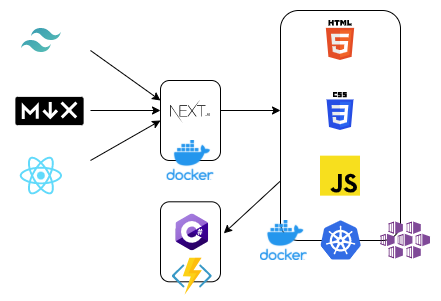

import FigCaption from '@/components/FigCaption';
import ogImage from './architecture.drawio.png';
export { ogImage };

As previously mentioned, [I don't like maintenance.](../gatsby-dekrey-dot-net/)
Gatsby was working well for me, so why did I want to change? Wait, was it
working well for me? The last blog post I made was in... oh, maybe it _wasn't_
working well for me.

I definitely was weary of all the packages that needed to be kept up-to-date.

```json
    "gatsby-image": "^2.4.9",
    "gatsby-plugin-manifest": "^2.4.14",
    "gatsby-plugin-offline": "^3.2.13",
    "gatsby-plugin-postcss": "^2.3.11",
    "gatsby-plugin-react-helmet": "^3.3.6",
    "gatsby-plugin-sharp": "^2.6.14",
    "gatsby-remark-images": "^3.3.18",
    "gatsby-remark-relative-images": "^0.3.0",
    "gatsby-remark-slug": "^0.1.0",
    "gatsby-remark-vscode": "^3.0.1",
    "gatsby-source-filesystem": "^2.3.14",
    "gatsby-transformer-remark": "^2.8.25",
    "gatsby-transformer-sharp": "^2.5.7",
```

Many of those felt like they didn't need to be gatsby-specific packages. For
instance, `react-helmet` could do its thing in other projects, why did I also
need `gatsby-plugin-react-helmet`? Surely a static site builder should be able
to support the head... (Granted, I'm out of date for gatsby, so maybe there is a
way now.)

Also, while the graphql interface was neat, it felt weird to pull from a
headless CMS (for a different project at work) to put into the "node" structure
and then load from there to make the site. Why have the extra step in between?

I was getting tired of Gatsby, and I wasn't keeping my site up to date as a result.

---

With work at Principle Studios, some of our team including [Josh
Roth](https://www.joshrothanimation.com/) and [Drew
Stromberg](https://www.linkedin.com/in/drewstromberg/) persuaded me that Next.js
should be something we look into for an upcoming project. Knowing a little bit
about it (supporting static export), it was already on my list, and I was
excited to try it out. While we made a proof of concept, it was a greenfield
project, so it doesn't quite scratch my itch of doing an apples-to-apples
comparison. I decided I'd rewrite my own site.

---

Since it follows so much of Gatsby's architecture, I decided to do a minimal conversion.

<figure>
	
	<FigCaption>Markdown via MDX, React, and tailwindcss assembled by Next.js in a Docker
		container publishing static HTML, CSS, and JS in a production Docker
		container, hosted on Azure Kubernetes Service (AKS) and calling out to an
		Azure Functions application for the Contact form.</FigCaption>
</figure>

The changes I made:

1. Convert all the packages from Gatsby to either Next.js or vanilla JavaScript equivalents.
2. Upgrade from markdown to [MDX](https://mdxjs.com/) for custom components so I can style the figure captions. Includes building a markdown pipeline.
   - Main processing was via `mdx-bundler`
   - This needed a "read time" and "excerpt" pipeline, which I couldn't figure out how to configure with `mdx-bundler`... I built it myself.
   - I also added `rehype-highlight` for code snippets.
3. Extract the favicon, etc. that was being generated by Gatsby and switch from `react-helmet` to the Next.js Head element
4. Remove all of Gatsby's graphql and replace with a simpler `getStaticProps` function.

And that was pretty much it. My `next.config.js` pretty much looks like this:

```js
module.exports = {
	// Append the default value with md extensions
	pageExtensions: ['ts', 'tsx', 'js', 'jsx', 'md', 'mdx'],
	// Force the export to add /index.html for each page
	trailingSlash: true,
};
```

There's a bit more to it since I included mdx there, too, but since I'm not using it (yet), I left it out from this example.

I still need to set up eslint with the new build, but that can wait for later.

Final change count: `+9,518 −21,113`. I think that's pretty great!

Thanks again to Josh and Drew for pushing me to a new technology!
