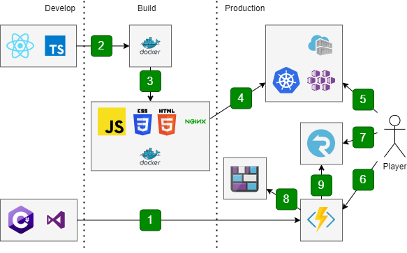

import FigCaption from '@/components/FigCaption';
import { TwitterTweetEmbed } from 'react-twitter-embed';
import image from './games-architecture.png';
export { image };

I enjoy classical games. Simple rules that combine in interesting ways are the
definitions of "emergent gameplay" that the games industry strives for in modern
games, whether multiplayer or single player, and it's these kinds of rules that
the best classical games are founded upon.

Initially, I built this project as an experiment with pattern matching and
SignalR in C# 8. I built a state machine using a simple reduce function that
takes in the previous state of the game board and the action being performed.
Originally wired into Rx.NET and served via a hosted SignalR hub, I wanted to
scale the application.

<TwitterTweetEmbed tweetId="1248639534650118145" />
{/* <blockquote class="twitter-tweet"><p lang="es" dir="ltr">Ah 1 replica :)</p>&mdash; David Fowler #BlackLivesMatter (@davidfowl) <a href="https://twitter.com/davidfowl/status/1248639534650118145?ref_src=twsrc%5Etfw">April 10, 2020</a></blockquote> */}

I had to do some refactoring, first. I simplified my [game logic interface](https://github.com/mdekrey/SignalRGammon/blob/0d9eaad12da859ce0ed11acddc1a69ec3cfc612d/SignalRGame/GameUtilities/IGameLogic.cs#L38-L49) to
just a few functions and allowed for serializing and deserializing certain
steps.

```csharp
public record GameState(object? State);
public record GameAction(object? Action);

public interface IGameLogic
{
    GameState InitialState();
    (GameState newState, bool isValid) PerformAction(GameState state, GameAction action);
    (GameAction action, bool hasAction) GetRecommendedAction(GameState state);
    string ToPublicGameState(GameState state, GameAction? action);

    string FromState(GameState state);
    GameState ToState(string state);
    GameAction ToAction(string action);
}
```

(Yes, I also started trying out C# 9. Feels pretty good!)

This way, each game could be serialized and deserialized to a string (JSON,
typically). Actions could be deserialized and applied to the state. "Recommended
Actions" were my way of continuing logic, such as determining winners, but could
be feasibly rolled into the `PerformAction` function... though, having the
state/action occur one at a time assists with the animations. The public game
state could feasibly hide some information, and different information could
eventually be passed to each player. (The actual interface also has a few
`ClaimsPrinciple` parameters, but they aren't used yet. I guess I failed at
YAGNI this time!)

Adjusting the game logic interface was a fair task, but it allowed me to extract
the hosted version of the code (still in the repository) to [using a sealed
`InMemoryGame`](https://github.com/mdekrey/SignalRGammon/blob/0d9eaad12da859ce0ed11acddc1a69ec3cfc612d/SignalRGame.Server/GameUtilities/InMemoryGame.cs)
instead of an Abstract Base Class.

Creating the Azure Function app was a bit more involved than the SignalR hub,
but not by much considering I also needed to persist the game state instead of
store in memory.

Ultimately, I built 5 Functions:

1. [`negotiate`](https://github.com/mdekrey/SignalRGammon/blob/0d9eaad12da859ce0ed11acddc1a69ec3cfc612d/SignalRGame.Functions/GameFunctions.cs#L41-L47):
   HTTP Trigger to simply let the user connect to SignalR. This used the
   `SignalRConnectionInfo` as an input binding to automatically create the
   user token based on a gamer id, a very weak form of authentication. (I
   figure anyone can walk up and screw up your game board of checkers, and
   since there's no leaderboard or scorekeeping, this isn't really a thing I
   needed to guard against yet.)

2. [`createGame`](https://github.com/mdekrey/SignalRGammon/blob/0d9eaad12da859ce0ed11acddc1a69ec3cfc612d/SignalRGame.Functions/GameFunctions.cs#L72-L110):
   HTTP Trigger that lets the user create a new game of a given type. The game's
   initial state and type is stored in Azure Blob storage, and the ID of the
   game is given back to the user. This also subscribes the user to the game.

   I avoided using SignalR's web hooks for the serverless triggers because it
   became harder to test locally.

3. [`getGameState`](https://github.com/mdekrey/SignalRGammon/blob/0d9eaad12da859ce0ed11acddc1a69ec3cfc612d/SignalRGame.Functions/GameFunctions.cs#L113-L140):
   HTTP Trigger that lets the user get an arbitrary game and subscribe to it.
   This uses Azure Blob Storage's input binding and SignalR's output bindings.

4. [`doAction`](https://github.com/mdekrey/SignalRGammon/blob/0d9eaad12da859ce0ed11acddc1a69ec3cfc612d/SignalRGame.Functions/GameFunctions.cs#L142-L183):
   HTTP Trigger that lets the user execute an action on a game. This uses an
   Azure Blob Storage input/output binding and SignalR's output bindings.

5. [`cleanup`](https://github.com/mdekrey/SignalRGammon/blob/0d9eaad12da859ce0ed11acddc1a69ec3cfc612d/SignalRGame.Functions/GameFunctions.cs#L49-L70):
   Timer Trigger that removes old blobs. This uses an Azure Blob Storage
   input/output binding.

All this brings me to the final architecture.

<figure>
	
	<FigCaption>Source code in C# and TypeScript/React, deployed to Azure Functions and
		Azure Kubernetes Service.</FigCaption>
</figure>

1. The C# source code was built and deployed via Visual Studio to Azure Functions.
2. The React/TypeScript source code was built in a multi-phase Dockerfile.
3. The multi-phase Dockerfile copied the output files into an nginx container.
4. The resulting Docker image is deployed to Azure Kubernetes Service via a
   Container Registry. (This could just as easily had static files deployed to a
   CDN, but I already have Let's Encrypt managed by my Kubernetes cluster and
   didn't want to change DNS records!)
5. Once it's all deployed, the user connects to [the
   games](https://games.dekrey.net) and loads up the HTML.
6. JavaScript makes a `negotiate` request to the Azure Functions, which directs
   the user to the appropriate SignalR service. The user will make all moves,
   game requests, etc. by issuing requests to the Functions.
7. The user immediately connects to SignalR service.
8. When the user requests a new game or makes a move, the Function will load and
   save new game state in Azure Blob Storage.
9. When the game state is updated, all relevant players will be notified via
   SignalR.

I think that basically covers it! I still have a bit more work that I want to
do, such as supporting games with secret information (such as a hand of cards),
but this works quite well for the two games I've made so far!

Thanks for reading through. Feel free to browse through the code, and if you
have questions or suggestions, I'm happy to hear them!
